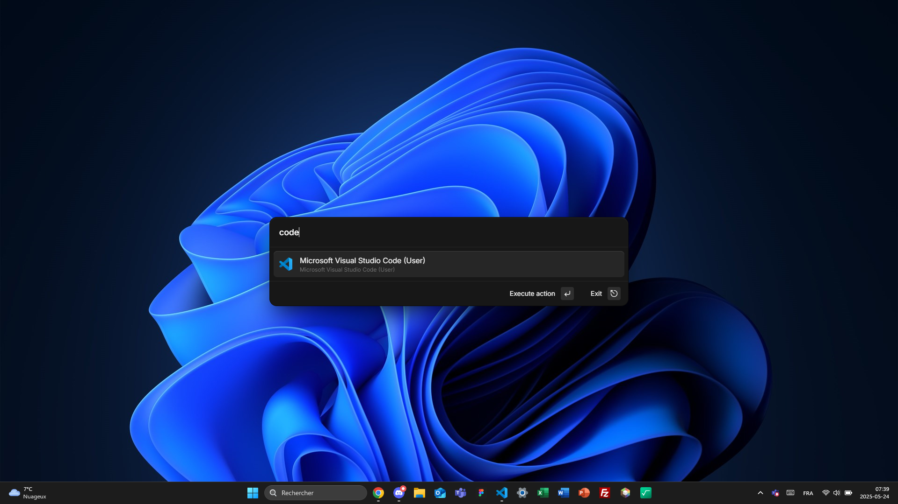
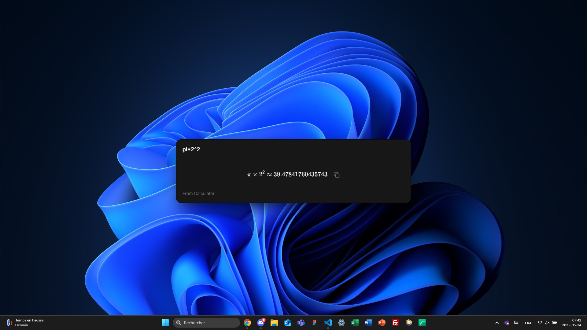
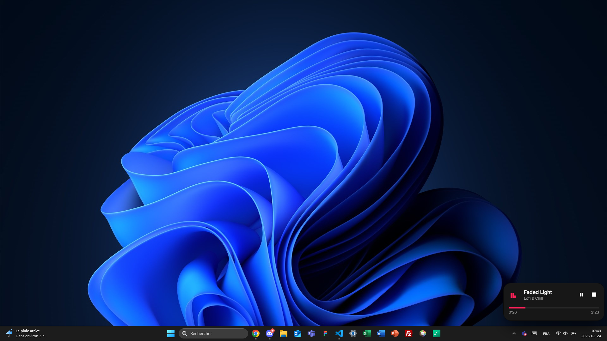
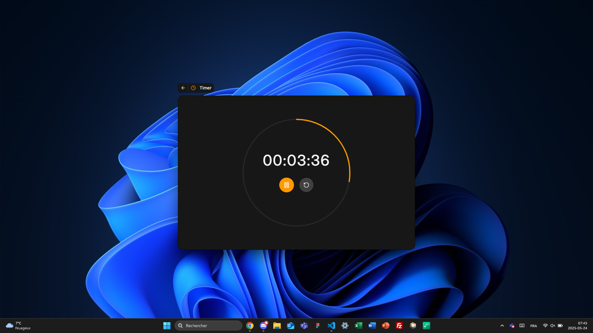

# Mage 🪄


|                                                 |                                                 |
| ----------------------------------------------- | ----------------------------------------------- |
|  |  |
|  |  |

Mage, originally a [Raycast](raycast.com) clone, is a lightweight and fast app launcher for Windows, built with Electron, Vite, and Vue 3. It features **custom applications**, **live activities**, **a modern UI** and a **batteries included SDK for developers**.

## Why mage?

At the very start, I made a simple proof-of-concept of this application named _WinCast_. It gave me a vision that every action could be a _spell_ casted (from the term winCast) by the user. This ended up to be named Mage, as the users are the magicians, and this tool, the useful magic wand.

## Getting started

If you want to contribute or customize Mage, clone the repository then run the following commands:

```sh
npm install # Install the required dependencies
npm run dev # Start the developement server
```

Consider making a pull request if you want to suggest a change to this project.

### Building Mage

```sh
npm run build
```

This will generate optimized output in the `dist/` folder which can then be packaged using Electron.

## Contributing

We happily welcome contributions! Here are a few ways you can help:

-   Report bugs or issues
-   Request new features
-   Improve documentation
-   Create and share plugins via **Mage Store** (coming soon)
-   Contribute code improvements and bug fixes

## License

Mage is open-source and licensed under the MIT License. See the LICENSE file for more details.

---

Made with ❤️ by magicians who love productivity.
